# 🎧 Awesome SMB Help Desk Software 🚀

  
  
  
  
  

## 📌 Top SMB Help Desk & Customer Support Software Ecosystem 💬

**A curated list of commercial SaaS help desk platforms and open-source customer support software repositories.**

*Focused on Shared Inboxes, Customer Support Ticket Management, Self-Hosted Help Desks, Live Chat & Knowledge Base Platforms.*

**Last updated: October 2026** 📅

---

## 💡 Overview & Market Insights 📈

The global **Help Desk & Customer Service Software market** is estimated at **$11.8 Billion** and is projected to expand at a CAGR of **9.4%**. 

The sector is **moderately fragmented**: while industry giants like **Salesforce** (Service Cloud) and **Zendesk** command significant market share among mid-market and enterprise businesses, the SMB segment remains vibrant with specialized cloud platforms (Freshdesk, Help Scout, Zoho Desk) and self-hosted open-source software (Chatwoot, UVdesk, GLPI, FreeScout).

---

## 📑 Table of Contents 📖

- [☁️ SaaS / Hosted Platforms](#-saas--hosted-platforms)
- [🔓 Open-Source GitHub Projects](#-open-source-github-projects)
- [🤝 How to Contribute](#-how-to-contribute)
- [⚠️ Disclaimer](#%EF%B8%8F-disclaimer)
- [☕ Support & Sponsorship](#-support--sponsorship)
- [⭐ Star History](#-star-history)

---

## ☁️ SaaS / Hosted Platforms 🏢

Below is a comparison of top commercial customer support platforms for SMBs, ordered by **Company Scale / Valuation (Descending)**:

| Platform | Starting Price (Paid Tier) | Free Tier / Trial Details | Company Scale / Valuation | Description & Best For |
| :--- | :--- | :--- | :--- | :--- |
| **[Salesforce Service Cloud](https://www.salesforce.com/products/service-cloud/)** 🏢 | $25 / agent / month | 30-day free trial (Full suite access) | **$300B+ Market Cap** | Enterprise & SMB customer service platform with omnichannel routing, CRM integration, and AI automation. |
| **[Zendesk Support](https://www.zendesk.com/)** 🟢 | $19 / agent / month | 14-day free trial (Suite Team tier) | **$10.2B Acquisition Valuation** | Industry-standard ticketing system with macros, triggers, and comprehensive integrations. Best for scaling SMBs. |
| **[Freshdesk](https://freshdesk.com/)** 🍃 | $15 / agent / month | **Free Forever Plan** (Up to 10 agents with basic ticketing & KB) | **$7.5B+ Market Cap (Freshworks)** | Modern SaaS help desk with automated ticket dispatch, knowledge base, and AI assistants. Best for overall SMB support. |
| **[Zoho Desk](https://www.zoho.com/desk/)** 🗂️ | $7 / agent / month | **Free Forever Plan** (Up to 3 agents with email ticketing & KB) | **$1B+ Revenue** | Feature-rich customer support software featuring Zia AI and deep Zoho CRM integration. Best for budget SMBs. |
| **[Help Scout](https://www.helpscout.com/)** 📬 | $20 / agent / month | 15-day free trial (Standard plan features) | **$100M+ Valuation ($30M+ ARR)** | Human-focused shared inbox with live chat and docs knowledge base. Best for email-first customer support teams. |
| **[LiveAgent](https://www.liveagent.com/)** 💬 | $9 / agent / month | 14-day free trial (All-in-one features) | **$50M+ Revenue** | All-in-one help desk platform with live chat widget, call center, social channels, and ticketing. |
| **[Hiver](https://hiverhq.com/)** ✉️ | $19 / user / month | 7-day free trial (Lite features) | **$30M+ Revenue** | Shared inbox solution built directly inside Google Workspace / Gmail. Best for Gmail-centric teams. |
| **[Groove HQ](https://www.groovehq.com/)** 🚀 | $16 / user / month | 7-day free trial (Starter plan) | **$10M+ Revenue** | Simple, streamlined help desk and shared inbox tailored for startups and small support teams. |
| **[SupportBee](https://supportbee.com/)** 🐝 | $13 / user / month | 14-day free trial (Startup plan) | **$2M+ Revenue** | Email-like shared inbox system for managing support emails seamlessly. |
| **[Cayzu](https://www.cayzu.com/)** ☁️ | $4 / agent / month | 30-day free trial (Basic features) | **Bootstrap / SMB Scale** | Affordable cloud support desk with custom branding, knowledge base, and self-service customer portal. |

---

## 🔓 Open-Source GitHub Projects 🌐

Self-hosted open-source support software grants total data sovereignty, zero per-agent license costs, and complete code control.

Sorted by **GitHub Star Count (Descending)**:

1. **[Chatwoot](https://github.com/chatwoot/chatwoot)**  💬
   - **Description**: Omnichannel customer engagement suite with live chat, email support, Captain AI agent, WhatsApp integration, and native Help Center.
   - **Tech Stack**: Ruby on Rails, Vue.js, PostgreSQL, Redis.
   - **License**: MIT License.

2. **[UVdesk Community](https://github.com/uvdesk/community-skeleton)**  🛍️
   - **Description**: Enterprise-grade PHP open-source helpdesk system built on Symfony with powerful e-commerce integrations (Magento, WordPress, WooCommerce, OpenCart).
   - **Tech Stack**: PHP / Symfony, MySQL.
   - **License**: MIT License.

3. **[GLPI](https://github.com/glpi-project/glpi)**  🖥️
   - **Description**: IT Service Management (ITSM) and help desk asset management system with support ticketing, ITIL compliance, and customer portal.
   - **Tech Stack**: PHP, MariaDB/MySQL.
   - **License**: GPL v3+.

4. **[Papercups](https://github.com/papercups-io/papercups)**  🥤
   - **Description**: Open-source customer messaging platform and live chat component designed as an open alternative to Intercom and Drift.
   - **Tech Stack**: Elixir / Phoenix, React, PostgreSQL.
   - **License**: MIT License.

5. **[Zammad](https://github.com/zammad/zammad)**  🛡️
   - **Description**: 100% open-source web-based support desk and ticketing system backed by the Zammad Foundation. Offers multi-channel automation and granular security.
   - **Tech Stack**: Ruby on Rails, PostgreSQL / MySQL, Elasticsearch.
   - **License**: AGPL v3.

6. **[FreeScout](https://github.com/freescout-help-desk/freescout)**  🕊️
   - **Description**: Super lightweight shared inbox and help desk designed as a privacy-friendly self-hosted Zendesk & Help Scout alternative. Runs on shared PHP hosting.
   - **Tech Stack**: PHP / Laravel, MySQL.
   - **License**: AGPL v3.

7. **[erxes](https://github.com/erxes/erxes)**  🔌
   - **Description**: Open-source experience operating system (XOS) combining customer service ticketing, live chat, email marketing, and team collaboration modules.
   - **Tech Stack**: Node.js, GraphQL, React, MongoDB.
   - **License**: AGPL v3.

8. **[osTicket](https://github.com/osTicket/osTicket)**  🎟️
   - **Description**: The veteran open-source support ticket system. Routes requests from email, web forms, and phone into a simple multi-user web portal.
   - **Tech Stack**: PHP 8.2-8.4, MySQL.
   - **License**: GPL v2.

9. **[Peppermint](https://github.com/peppermint-lab/peppermint)**  🌿
   - **Description**: Compact open-source ticket management software and support desk system for managing client support workflows effortlessly.
   - **Tech Stack**: Node.js / Next.js, PostgreSQL.
   - **License**: MIT License.

10. **[Live Helper Chat](https://github.com/livehelperchat/livehelperchat)**  💬
    - **Description**: Open-source live support chat application with voice, video, Telegram, WhatsApp, and automated bot extensions.
    - **Tech Stack**: PHP, MySQL.
    - **License**: Apache 2.0.

11. **[Trudesk](https://github.com/polonel/trudesk)**  ⚡
    - **Description**: Clean Node.js and MongoDB based open-source help desk software featuring real-time ticket updates and knowledge base management.
    - **Tech Stack**: Node.js, Express, MongoDB.
    - **License**: MIT License.

12. **[Helpy](https://github.com/helpyio/helpy)**  🆘
    - **Description**: Modern customer support desk with integrated knowledge base, community forums, and email ticketing.
    - **Tech Stack**: Ruby on Rails, PostgreSQL.
    - **License**: MIT License.

---

## 🤝 How to Contribute 🛠️

Contributions are welcome! Follow these steps to submit additions or updates:

1. Fork the repository.
2. Add or update entries in `README.md` following the tabular or badge format.
3. Keep descriptions concise, factual, and include relevant licensing or market links.
4. Open a Pull Request with a clear title and description.

---

## ⚠️ Disclaimer 📜

- This list is **community-curated** for information purposes and is not an endorsement.
- Support platforms handle sensitive customer PII. Self-hosted solutions require security hardening, SSL setup, and data privacy compliance (GDPR, CCPA).
- Verify terms, pricing, and licenses directly on official vendor websites before deployment.

---

## ☕ Support & Sponsorship 💖

If you found this list helpful for evaluating SMB help desk software, please consider starring ⭐, forking 🍴, and sharing the repository!

**Thank you for your support!** 🚀

---

## ⭐ Star History 📊

